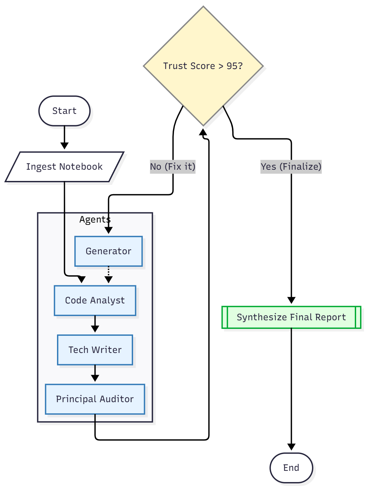

# Kaggle Auto-Auditor
### *An Agentic System for Self-Correcting Data Science*

[](https://colab.research.google.com/github/HyperspaceDan/Kaggle_Auto_Auditor/blob/main/Kaggle_Auto_Auditor_(CapstoneProject).ipynb)
[](https://www.kaggle.com/competitions/agents-intensive-capstone-project)
[](https://www.kaggle.com/competitions/agents-intensive-capstone-project)
[](https://deepmind.google/technologies/gemini/)

> **🏆 Capstone Project Submission: Freestyle Track**

#### This project is a submission to the Kaggle Agents Intensive Capstone Project under the 'Freestyle' track.

[View project on NBViewer (if GitHub fails to render)](https://nbviewer.org/github/HyperspaceDan/Kaggle_Auto_Auditor/blob/main/Kaggle_Auto_Auditor_(CapstoneProject).ipynb)

## 🚀 Overview: From Passive Linter to Active Enhancer
The Kaggle Auto-Auditor is a next-generation multi-agent system designed to tackle the "Reproducibility Crisis" in public data science.

Traditional code reviewers are passive—they simply flag errors and leave the user to fix them. The Auto-Auditor is active. It utilizes a self-correcting feedback loop powered by LangGraph and Google Gemini 2.5 to autonomously:

* Ingest raw Kaggle notebooks.
* Audit code quality, documentation, and reproducibility.
* Generate fixes for identified flaws.
* Verify its own work through iterative critiques until a "Trust Score" of 95+ is achieved.

By replacing the human-in-the-loop with a "Critic Agent," this system transforms a 60-minute manual review process into a fully autonomous, zero-cost workflow.

## The Problem: The "Black Box" Notebook
Kaggle is the world’s largest data science community, but there exists a high noise-to-signal ratio — users may often encounter redundant, poorly documented, or non-reproducible notebooks that make finding reliable solutions time-consuming.

* **Reproducibility**: Many notebooks fail to run due to hardcoded paths or missing dependencies.
* **Documentation**: Complex logic is often presented as a "wall of code" with no narrative explanation.
* **Verification**: Manually vetting a notebook takes 30-60 minutes per file.

## The Solution: An Agentic Loop
The Auto-Auditor automates this vetting process using a Cyclic Multi-Agent Architecture.

* **Ingestion**: Fetches the raw .ipynb JSON from Kaggle.
* **Audit**: Three specialized agents (Code, Docs, Capabilities) critique the work.
* **Correction**: If the "Trust Score" is below 95/100, the Corrective Agent **rewrites** the cells.
* **Verification Loop**: The system re-audits the new code. This cycle continues until the score is maximized or the iteration limit is reached.

## Technical Architecture
The system is built on LangGraph for state management and leverages Google Gemini 2.5 Flash to enable fast, cost-efficient reasoning. It replaces the traditional human-in-the-loop with an autonomous 'Critic Agent,' creating a fully self-regulating feedback loop.



### Key Components
* GraphState: A strictly typed TypedDict that serves as the shared memory for the swarm.
* Structure-Aware Ingestion: Unlike simple text scrapers, this system preserves the .ipynb cell structure (Code vs. Markdown), allowing it to reconstruct valid notebooks after editing.
* Resiliency Layer: Includes robust Regex parsing to handle malformed LLM outputs and automatic time.sleep backoffs to handle API Rate Limits (429 Errors).


## Setup & Usage
### Option 1: Run in Google Colab (Recommended)
1. Click the "Open in Colab" badge above.
2. Upload kaggle.json: You will be prompted to upload your Kaggle API key file.
3. Set Secrets: Add your GEMINI_API_KEY to the Colab "Secrets" manager (Key symbol on the left sidebar).
4. Run All: The notebook will install dependencies and start the UI.
   
### Option 2: Run Locally / Kaggle Notebook
Clone this repository:


```Bash

git clone https://github.com/HyperspaceDan/Kaggle_Auto_Auditor.git
cd Kaggle-Auto-Auditor
```
Install dependencies:

```Bash

pip install -r requirements.txt
```
Set Environment Variables:

```Python

export GOOGLE_API_KEY="your_key_here"
# Ensure ~/.kaggle/kaggle.json exists
```

## Methodology & Limitations
* Clean Slate Policy: To ensure absolute reproducibility, the Auto-Auditor clears all pre-computed outputs (graphs, tables) and strips binary attachments (images dragged into markdown). This forces the user to re-run the corrected_notebook.ipynb to verify that the code actually generates the results claimed.
* Rate Limits: The system is optimized for the Gemini Free Tier. If it hits a Rate Limit (429), it will automatically sleep for 60 seconds and retry.

## 🧪 Case Study: Self-Correction in Action
The Auto-Auditor was tested on Colin Morris's *Strings and Dictionaries* [tutorial](https://www.kaggle.com/code/colinmorris/strings-and-dictionaries). The logs demonstrate the agent's unique ability to critique its own work and recover from bad generations.

| Stage | Action | Trust Score | System Behavior |
| :--- | :--- | :--- | :--- |
| **Initial Scan** | Audit | **93/100** | The Auditor identified minor flaws in modularity and error handling. Since the score was < 95, the **Correction Loop** was triggered. |
| **Iteration 1** | Correction | **70/100** | The Generator attempted fixes, but the subsequent re-audit detected a regression (quality drop). The system **rejected the finalization** and forced a retry. |
| **Iteration 2** | Correction | **97/100** | The Generator self-corrected the previous regression. The Auditor validated the new modular code and error handling, clearing the notebook for final export. |

**Result:** The system autonomously raised the quality ceiling of an already good notebook and prevented a regression from being published.
* [View Original Notebook](https://www.kaggle.com/code/colinmorris/strings-and-dictionaries)
* [View Final Output Notebook](./artifacts/corrected_notebook_v2.ipynb)
* [View Auto-Auditor's Log (`execution_logs.json`)](./artifacts/execution_logs.json)

## 📂 Repository Structure
```text
/Kaggle-Auto-Auditor
│
├── Kaggle_Auto_Auditor.ipynb    # The Main Agent Application (Colab/Kaggle)
├── requirements.txt             # Project dependencies
├── README.md                    # Project documentation
│
└── artifacts/                   # Proof of Execution
    ├── corrected_notebook_v2.ipynb  # The "After" result
    └── execution_logs.json          # The full audit trail (JSON)
```

## ⚖️ Disclaimer & Attribution
This project uses public Kaggle notebooks as test cases to demonstrate the **Auto-Auditor's** capabilities.
* **Original Notebooks:** The input code is owned by its respective authors on Kaggle.
* **Modifications:** The "Corrected" versions output by this system are derivative works generated by an AI agent for educational and auditing purposes.
* **Test Case:** [Strings and Dictionaries](https://www.kaggle.com/code/colinmorris/strings-and-dictionaries) by Colin Morris and [Jupyter Notebook 101](https://www.kaggle.com/code/jhoward/jupyter-notebook-101) by Jeremy Howard.

## Project Status
* Track: Freestyle
* Status: Complete
* License: BSD 3-Clause License
